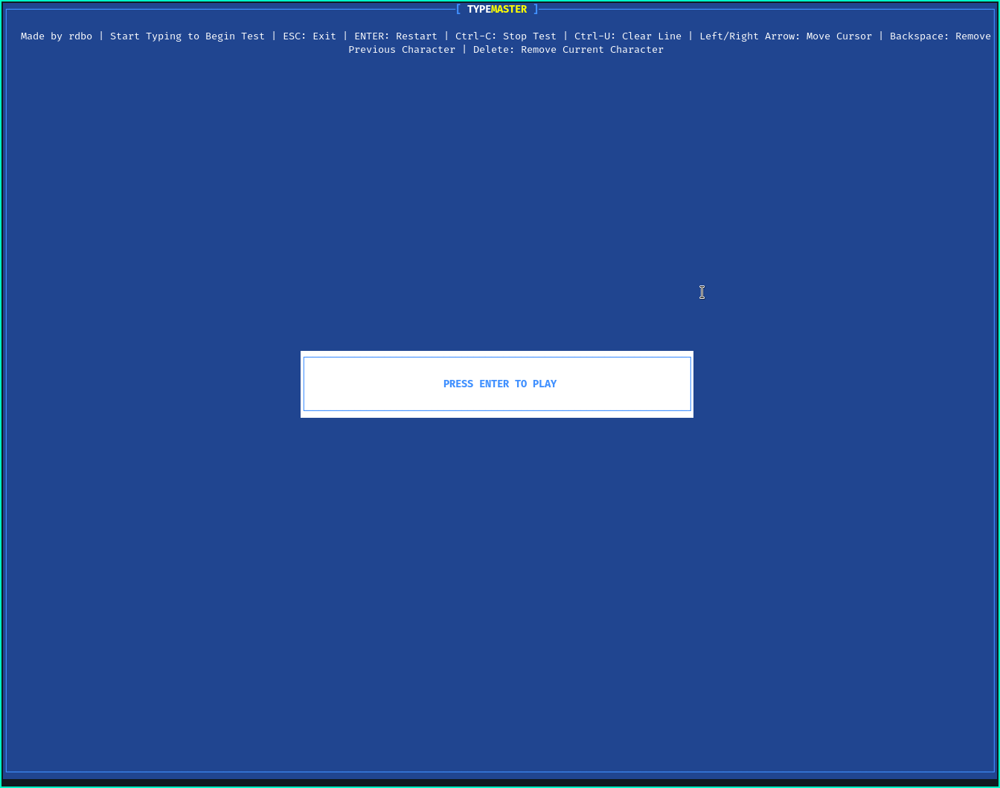
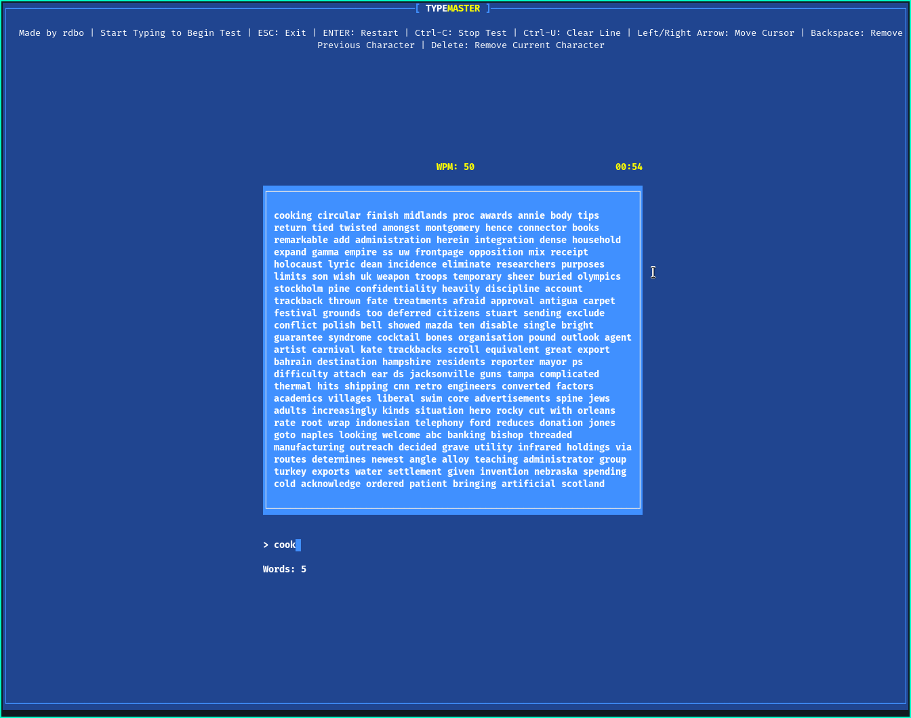

# TypeMaster
A terminal-based typing test written in Rust




# Building
Make sure you have installed:
- Git
- Rust (rustup recommended)
Run the following commands:
```
git clone https://github.com/rdbo/typemaster-cli
cd typemaster-cli
cargo build
```
Use the following command to run TypeMaster:
```
cargo run
```
